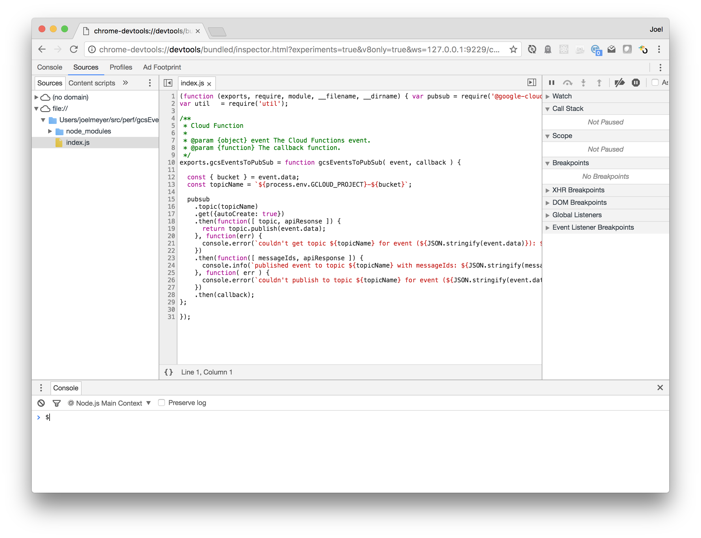
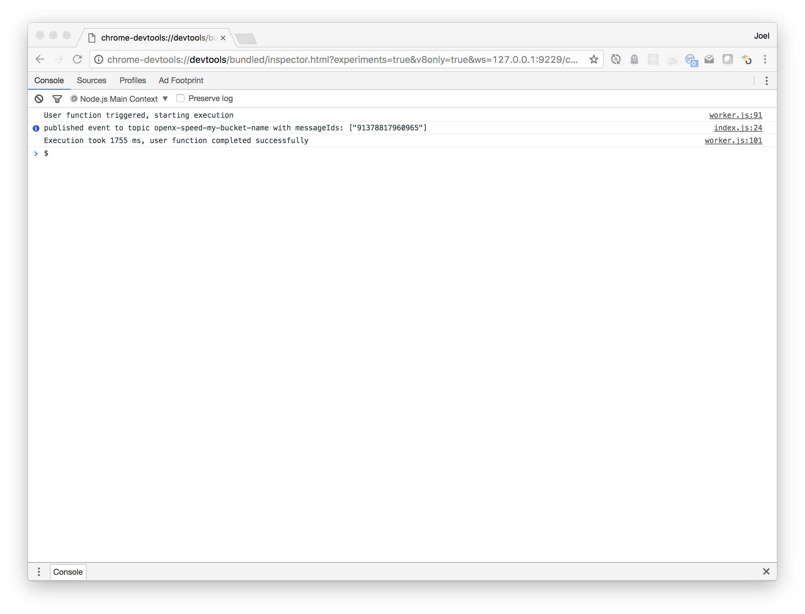

# gcsEventsToPubSub
Subscribes to bucket notifications and publishes those events to a PubSub topic.

The code is extremely straightforward, and it's possible (likely?) that Google will at some point make this unnecessary. For now, this project serves as a band-aid and also as an example of a way to use [Google Cloud Functions](https://cloud.google.com/functions/). I'm far from a Node expert, but I've tried to do some things to make it easy to use/test/develop the code base. Feedback and improvements are welcome.

## Topic
The PubSub topic will be named by concatenating the project name (to which you deployed the Cloud Function) with the name of the bucket, using a hyphen. For example, if your GCP project is named `gcp-is-awsome` and your bucket is named `cloudstorage-ftw`, then the topic name would be `gcp-is-awesome-cloudstorage-ftw`.

## Pre-requisites
* Your GCP account must be enabled to use [Google Cloud Functions](https://cloud.google.com/functions/) (currently in beta).
* [NodeJS](https://nodejs.org/) must be installed.
* [gcloud](https://cloud.google.com/sdk/gcloud/) must be installed.

## Deploying
1. Clone this repo:
    ```
    git clone git@github.com:JoelPM/gcsEventsToPubSub.git
    ```
2. Install dependencies:
    ```
    npm install
    ```
3. Run deploy command with staging bucket and bucket to watch:
    ```
    npm run prod-deploy my-staging-bucket my-bucket-to-watch
    ```

## To Dos
There are some items that should be looked into/taken care of at some point.
* Make it possible to watch multiple buckets.
* Create a default subscription so events don't get lost if no subscriber?

## Development
There are a number of npm run tasks that have been added to (hopefully) make it easier to run the Cloud Function locally. Most of these tasks are just aliases to the [Google Cloud Function Emulator](https://www.npmjs.com/package/@google-cloud/functions-emulator), which is installed as a local dev dependency.

Assuming you've cloned the repo and installed the dependencies (see [Deploying](#deploying), you have the following tasks available:

Task               | Description                                                                                  | Usage Example 
-------------------|----------------------------------------------------------------------------------------------|--------------
f                  | An alias to the `functions` command provided by the emulator.                                | `npm run f help`
f&#x2011;start     | Start the emulator.                                                                          | `npm run f-start`
f&#x2011;deploy    | Deploy the function to the emmulator.                                                        | `npm run f-deploy bucket-to-watch`
f&#x2011;inspect   | Make the function available for debugging.                                                   | `npm run f-inspect`
f&#x2011;logs      | Read the logs.                                                                               | `npm run f-logs`
f&#x2011;status    | Get status of the emulator.                                                                  | `npm run f-status`
f&#x2011;call      | Generates a GCS event call using the data in test/gcs_add_event.json.                        | `npm run f-call`
f&#x2011;delete    | Undeploys the cloud function from the emulator.                                              | `npm run f-delete`
f&#x2011;stop      | Stops the emulator gracefully.                                                               | `npm run f-stop`
f&#x2011;kill      | Stops the emulator with a stern glare and a no-nonsense tone of voice.                       | `npm run f-kill`
prod&#x2011;deploy | Deploys the Cloud Function to GCP (assumes you have the current project enabled via gcloud). | `npm run prod-deploy MY_STAGING_BUCKET MY_WATCH_BUCKET`

If you want to run things locally and connect with the chomre devtools debugger, you'd do this:

```shell
[joelmeyer@persevere:perf/gcsEventsToPubSub]$ npm run f-start

> gcsEventsToPubSub@0.0.1 f-start /Users/joelmeyer/src/perf/gcsEventsToPubSub
> functions start

Starting Google Cloud Functions Emulator...
Google Cloud Functions Emulator STARTED
┌──────────────┬──────────────────────────────────────────────────┬─────────────────┐
│ Name         │ Trigger                                          │ Resource        │
├──────────────┼──────────────────────────────────────────────────┼─────────────────┤
│ csEventsToPS │ providers/cloud.storage/eventTypes/object.change │ my-bucket-name  │
└──────────────┴──────────────────────────────────────────────────┴─────────────────┘
[joelmeyer@persevere:perf/gcsEventsToPubSub]$ npm run f-deploy MY-BUCKET-NAME

> gcsEventsToPubSub@0.0.1 f-deploy /Users/joelmeyer/src/perf/gcsEventsToPubSub
> functions deploy gcsEventsToPubSub --trigger-bucket "my-bucket-name"

Function gcsEventsToPubSub deployed.
┌────────────┬────────────────────────────────────────────────────────────────────────────────────────────────────────────┐
│ Property   │ Value                                                                                                      │
├────────────┼────────────────────────────────────────────────────────────────────────────────────────────────────────────┤
│ Name       │ gcsEventsToPubSub                                                                                          │
├────────────┼────────────────────────────────────────────────────────────────────────────────────────────────────────────┤
│ Trigger    │ providers/cloud.storage/eventTypes/object.change                                                           │
├────────────┼────────────────────────────────────────────────────────────────────────────────────────────────────────────┤
│ Resource   │ my-bucket-name                                                                                             │
├────────────┼────────────────────────────────────────────────────────────────────────────────────────────────────────────┤
│ Local path │ /Users/joelmeyer/src/perf/gcsEventsToPubSub                                                                │
├────────────┼────────────────────────────────────────────────────────────────────────────────────────────────────────────┤
│ Archive    │ file:///var/folders/t8/k2sjhd216558bmjhy8w9plw00000gn/T/us-central1-gcsEventsToPubSub-63878R31PX3jFFKp.zip │
└────────────┴────────────────────────────────────────────────────────────────────────────────────────────────────────────┘
[joelmeyer@persevere:perf/gcsEventsToPubSub]$ npm run f-inspect

> gcsEventsToPubSub@0.0.1 f-inspect /Users/joelmeyer/src/perf/gcsEventsToPubSub
> functions inspect gcsEventsToPubSub && npm run f-logs | grep devtools

Debugger for gcsEventsToPubSub listening on port 9229.
    chrome-devtools://devtools/bundled/inspector.html?experiments=true&v8only=true&ws=127.0.0.1:9229/c76aa0c6-b659-4176-b9a4-d4a2d9cea5d5
```

And then you'd paste that devtools URL into your browser of choice (as long as it's Chrome):



Trigger a call:
```zsh
[joelmeyer@persevere:perf/gcsEventsToPubSub]$ npm run f-call

> gcsEventsToPubSub@0.0.1 f-call /Users/joelmeyer/src/perf/gcsEventsToPubSub
> functions call gcsEventsToPubSub --file=./test/gcs_add_event.json

ExecutionId: b2406972-e498-48c6-97d2-e9e5c4561296
```

And view the results in the console:



And there you have it.
